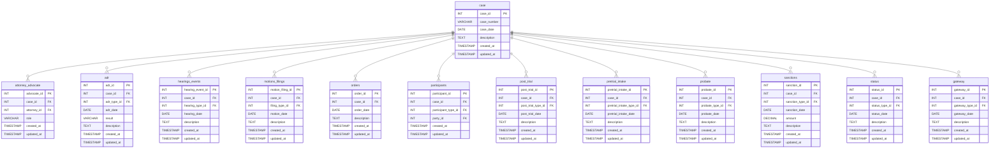

```mermaid
erDiagram
    case {
        INT case_id PK
        VARCHAR case_number
        DATE case_date
        TEXT description
        TIMESTAMP created_at
        TIMESTAMP updated_at
    }

    attorney_advocate {
        INT advocate_id PK
        INT case_id FK
        INT attorney_id FK
        VARCHAR role
        TIMESTAMP created_at
        TIMESTAMP updated_at
    }

    adr {
        INT adr_id PK
        INT case_id FK
        INT adr_type_id FK
        DATE adr_date
        VARCHAR result
        TEXT description
        TIMESTAMP created_at
        TIMESTAMP updated_at
    }

    hearings_events {
        INT hearing_event_id PK
        INT case_id FK
        INT hearing_type_id FK
        DATE hearing_date
        TEXT description
        TIMESTAMP created_at
        TIMESTAMP updated_at
    }

    motions_filings {
        INT motion_filing_id PK
        INT case_id FK
        INT filing_type_id FK
        DATE motion_date
        TEXT description
        TIMESTAMP created_at
        TIMESTAMP updated_at
    }

    orders {
        INT order_id PK
        INT case_id FK
        DATE order_date
        TEXT description
        TIMESTAMP created_at
        TIMESTAMP updated_at
    }

    participants {
        INT participant_id PK
        INT case_id FK
        INT participant_type_id FK
        INT party_id FK
        TIMESTAMP created_at
        TIMESTAMP updated_at
    }

    post_trial {
        INT post_trial_id PK
        INT case_id FK
        INT post_trial_type_id FK
        DATE post_trial_date
        TEXT description
        TIMESTAMP created_at
        TIMESTAMP updated_at
    }

    pretrial_intake {
        INT pretrial_intake_id PK
        INT case_id FK
        INT pretrial_intake_type_id FK
        DATE pretrial_intake_date
        TEXT description
        TIMESTAMP created_at
        TIMESTAMP updated_at
    }

    probate {
        INT probate_id PK
        INT case_id FK
        INT probate_type_id FK
        DATE probate_date
        TEXT description
        TIMESTAMP created_at
        TIMESTAMP updated_at
    }

    sanctions {
        INT sanction_id PK
        INT case_id FK
        INT sanction_type_id FK
        DATE sanction_date
        DECIMAL amount
        TEXT description
        TIMESTAMP created_at
        TIMESTAMP updated_at
    }

    status {
        INT status_id PK
        INT case_id FK
        INT status_type_id FK
        DATE status_date
        TEXT description
        TIMESTAMP created_at
        TIMESTAMP updated_at
    }

    gateway {
        INT gateway_id PK
        INT case_id FK
        INT gateway_type_id FK
        DATE gateway_date
        TEXT description
        TIMESTAMP created_at
        TIMESTAMP updated_at
    }

    case ||--o{ attorney_advocate : ""
    case ||--o{ adr : ""
    case ||--o{ hearings_events : ""
    case ||--o{ motions_filings : ""
    case ||--o{ orders : ""
    case ||--o{ participants : ""
    case ||--o{ post_trial : ""
    case ||--o{ pretrial_intake : ""
    case ||--o{ probate : ""
    case ||--o{ sanctions : ""
    case ||--o{ status : ""
    case ||--o{ gateway : ""

```