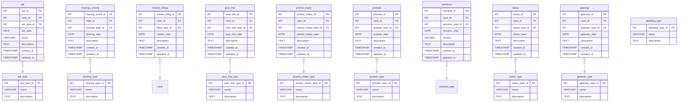

```mermaid
erDiagram
    adr {
        INT adr_id PK
        INT case_id FK
        INT adr_type_id FK
        DATE adr_date
        VARCHAR result
        TEXT description
        TIMESTAMP created_at
        TIMESTAMP updated_at
    }

    adr_type {
        INT adr_type_id PK
        VARCHAR name
        TEXT description
    }

    hearings_events {
        INT hearing_event_id PK
        INT case_id FK
        INT hearing_type_id FK
        DATE hearing_date
        TEXT description
        TIMESTAMP created_at
        TIMESTAMP updated_at
    }

    hearing_type {
        INT hearing_type_id PK
        VARCHAR name
        TEXT description
    }

    motions_filings {
        INT motion_filing_id PK
        INT case_id FK
        INT filing_type_id FK
        DATE motion_date
        TEXT description
        TIMESTAMP created_at
        TIMESTAMP updated_at
    }

    post_trial {
        INT post_trial_id PK
        INT case_id FK
        INT post_trial_type_id FK
        DATE post_trial_date
        TEXT description
        TIMESTAMP created_at
        TIMESTAMP updated_at
    }

    pretrial_intake {
        INT pretrial_intake_id PK
        INT case_id FK
        INT pretrial_intake_type_id FK
        DATE pretrial_intake_date
        TEXT description
        TIMESTAMP created_at
        TIMESTAMP updated_at
    }

    probate {
        INT probate_id PK
        INT case_id FK
        INT probate_type_id FK
        DATE probate_date
        TEXT description
        TIMESTAMP created_at
        TIMESTAMP updated_at
    }

    sanctions {
        INT sanction_id PK
        INT case_id FK
        INT sanction_type_id FK
        DATE sanction_date
        DECIMAL amount
        TEXT description
        TIMESTAMP created_at
        TIMESTAMP updated_at
    }

    status {
        INT status_id PK
        INT case_id FK
        INT status_type_id FK
        DATE status_date
        TEXT description
        TIMESTAMP created_at
        TIMESTAMP updated_at
    }

    gateway {
        INT gateway_id PK
        INT case_id FK
        INT gateway_type_id FK
        DATE gateway_date
        TEXT description
        TIMESTAMP created_at
        TIMESTAMP updated_at
    }

    gateway_type {
        INT gateway_type_id PK
        VARCHAR name
        TEXT description
    }

    pleading_type {
        INT pleading_type_id PK
        VARCHAR name
        TEXT description
    }

    post_trial_type {
        INT post_trial_type_id PK
        VARCHAR name
        TEXT description
    }

    pretrial_intake_type {
        INT pretrial_intake_type_id PK
        VARCHAR name
        TEXT description
    }

    probate_type {
        INT probate_type_id PK
        VARCHAR name
        TEXT description
    }

    status_type {
        INT status_type_id PK
        VARCHAR name
        TEXT description
    }

    adr }o--|| adr_type : ""
    hearings_events }o--|| hearing_type : ""
    motions_filings }o--|| case : ""
    post_trial }o--|| post_trial_type : ""
    pretrial_intake }o--|| pretrial_intake_type : ""
    probate }o--|| probate_type : ""
    sanctions }o--|| sanction_type : ""
    status }o--|| status_type : ""
    gateway }o--|| gateway_type : ""

```